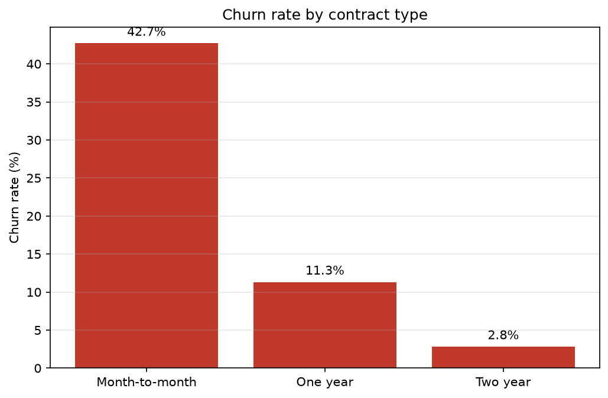
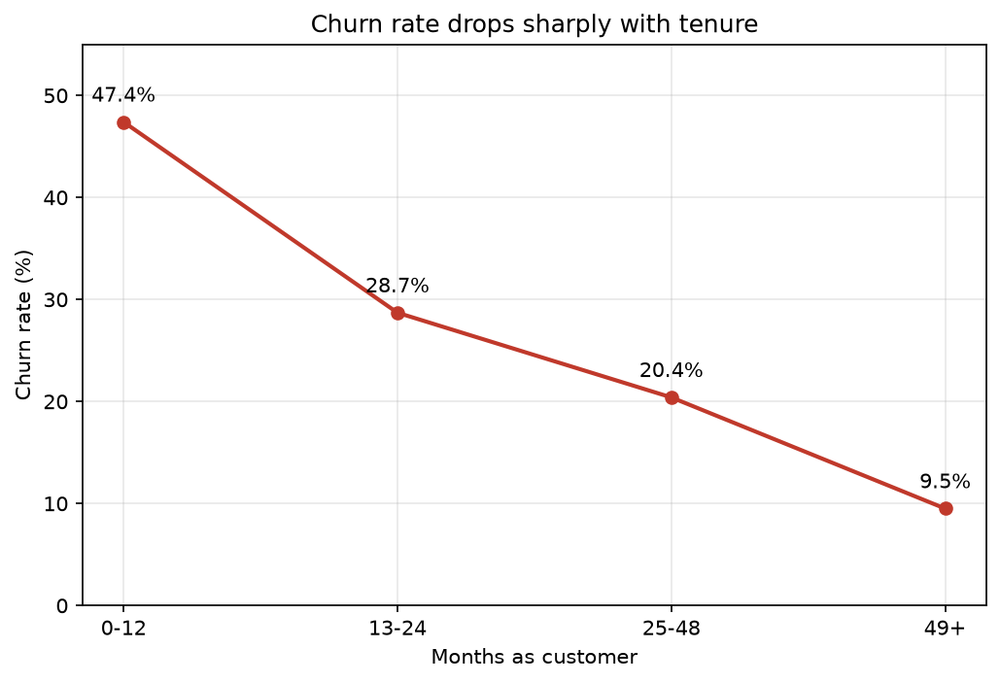
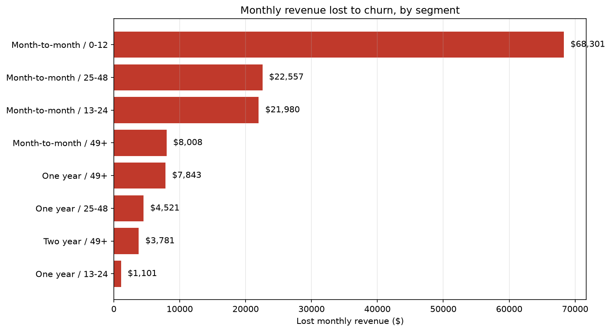
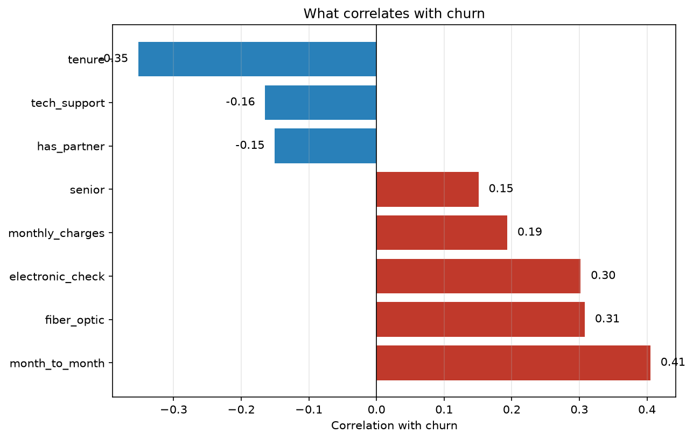
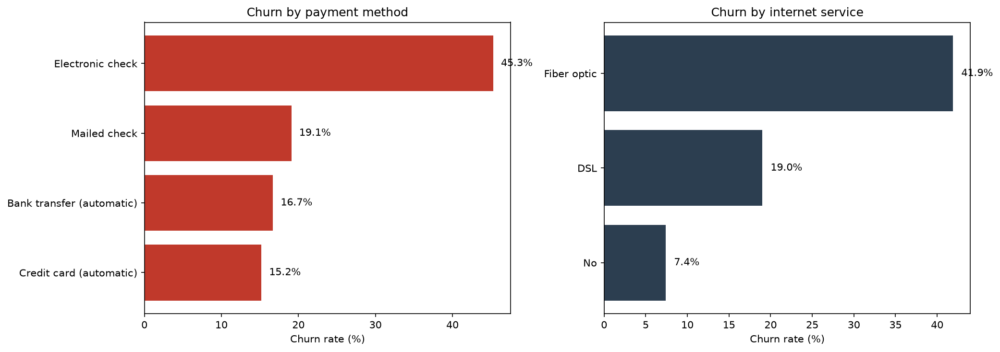

# Telco Customer Churn Analysis

A business-focused analysis of customer churn for a telecommunications
provider: identifying who leaves, what it costs, and where retention efforts
would pay off.

**[View the interactive dashboard on Tableau Public](https://public.tableau.com/app/profile/georgios.kalaidopoulos/viz/TelcoCustomerChurnAnalysis_17880996936820/TelcoCustomerChurnWhereRetentionShouldFocus)**

## Question

26.5% of customers left. Which segments drive that loss, and where should
retention spend be directed first?

## Dataset

[IBM Telco Customer Churn](https://www.kaggle.com/datasets/blastchar/telco-customer-churn)
— 7,043 customers with contract type, tenure, services, billing details and
churn status. Loaded into MySQL for analysis.

## Approach

The analysis ran in two passes.

**First pass — SQL.** Six queries building progressively: overall churn rate,
segmentation by contract type and tenure, a check for confounding between the
two, revenue impact, and segment-level financial prioritisation.

**Second pass — pandas, then back to SQL.** A correlation analysis in pandas
tested all available variables at once, and surfaced two signals the initial
queries had not covered: payment method and internet service type. Two further
SQL queries were written to quantify the actual churn rates behind those
signals.

**Third pass — Tableau.** The findings were rebuilt as an interactive dashboard
so that non-technical stakeholders can filter by contract type or tenure and
explore the segments themselves, rather than reading fixed charts.

This is worth noting as a lesson in sequencing: a broad exploratory pass
(correlations, distributions) is better placed *before* targeted queries, not
after. Starting from assumptions worked here, but only because the initial
assumptions happened to be correct.

## Findings & Recommendations

### 1. Contract type is the strongest churn driver
Month-to-month customers churn at **42.7%**, versus 11.3% (one year) and
2.8% (two year) — a 15x gap. They are also the largest group: 3,875 of
7,043 customers (55%).

### 2. The first year is the critical window
Churn falls steadily with tenure: **47.4%** in the first 12 months, 28.7%
at 13-24 months, 20.4% at 25-48, and 9.5% beyond 49 months.

### 3. The contract effect holds independently of tenure
Comparing contracts *within* each tenure band confirms the two factors act
separately — among customers under 12 months, month-to-month churns at
51.4% versus 10.5% on annual contracts. Contract type is not simply a proxy
for being a new customer.

### 4. Churned customers are worth more than average
Churn represents 26.5% of customers but **30.5% of monthly revenue**
(139,131 USD of 456,117 USD). Leavers pay roughly 74 USD/month against a
65 USD average — the business is losing its higher-value accounts.

### 5. One segment dominates the financial loss
New customers (0-12 months) on month-to-month contracts account for
**68,301 USD/month** in lost revenue — 3x the next segment. Month-to-month
overall accounts for around 87% of all lost revenue.

### 6. Payment method is a strong, actionable signal
Customers paying by electronic check churn at **45.3%**, versus 16.7%
(bank transfer) and 15.2% (credit card). They are a third of the customer
base but account for 57% of all churn.

### 7. Fiber optic customers churn at more than double the DSL rate
Fiber optic: **41.9%**, versus 19.0% for DSL and 7.4% for customers with no
internet service. The data cannot separate whether this reflects price,
expectations, or service quality — fiber is the premium tier, so cost is a
confounding factor. Investigating it would require complaints or satisfaction
data.

---

## Recommended actions

Three interventions, ordered by ease of implementation:

**1. Incentivise automatic payment (lowest effort)**
Offer a small monthly discount to electronic-check customers who switch to
direct debit or card. This is a low-commitment ask, and the gap between
electronic check (45.3%) and automatic methods (~16%) is the largest
single-factor difference in the data.
*Target group:* 2,365 customers — 34% of the base, 57% of all churn.

**2. Strengthen the first-year experience**
Churn peaks at 47.4% in the first 12 months and falls steadily thereafter.
Concentrate onboarding contact, proactive support and check-ins in this
window rather than spreading retention effort evenly across the base.
*Note:* customers with tech support churn less (r = -0.17), which suggests
support contact is worth testing as a retention lever.

**3. Move month-to-month customers onto annual contracts (highest impact,
highest friction)**
Month-to-month customers are 55% of the base and account for ~87% of lost
revenue. An upgrade incentive — a discounted first year, or added services —
addresses the largest financial exposure, but asks for real commitment and
will convert a smaller share.
*Target group first:* new month-to-month customers (0-12 months), worth
68,301 USD/month in lost revenue.

### How to validate

None of these follow causally from the analysis — the data shows association
only. Each should run as a pilot against a matched control group, with churn
measured over a defined window before any wider rollout.

## Charts

## Caveats

- `MonthlyCharges` is a point-in-time value, so annualised figures are estimates.
- The dataset has no time dimension — churn timing is unknown.
- Two-year contracts in early tenure bands have small samples (68 and 90 customers).
- All findings are associations; the data does not support causal claims.

## Files

- `churn_queries.sql` — eight SQL queries, commented
- `churn_analysis.ipynb` — pandas correlation analysis and charts
-  Interactive dashboard hosted on Tableau Public (link above)

## Tools

MySQL · Python (pandas, SQLAlchemy, matplotlib) · Jupyter · Tableau Public
